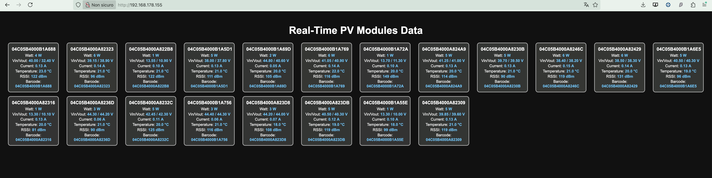
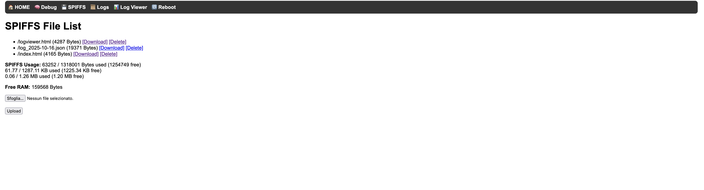
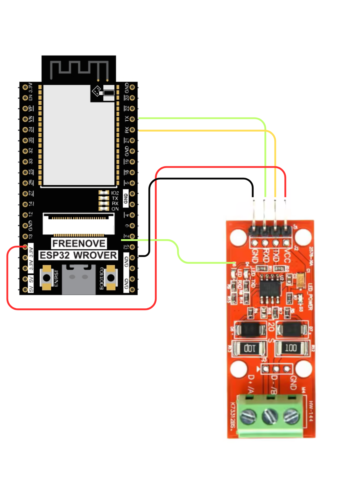
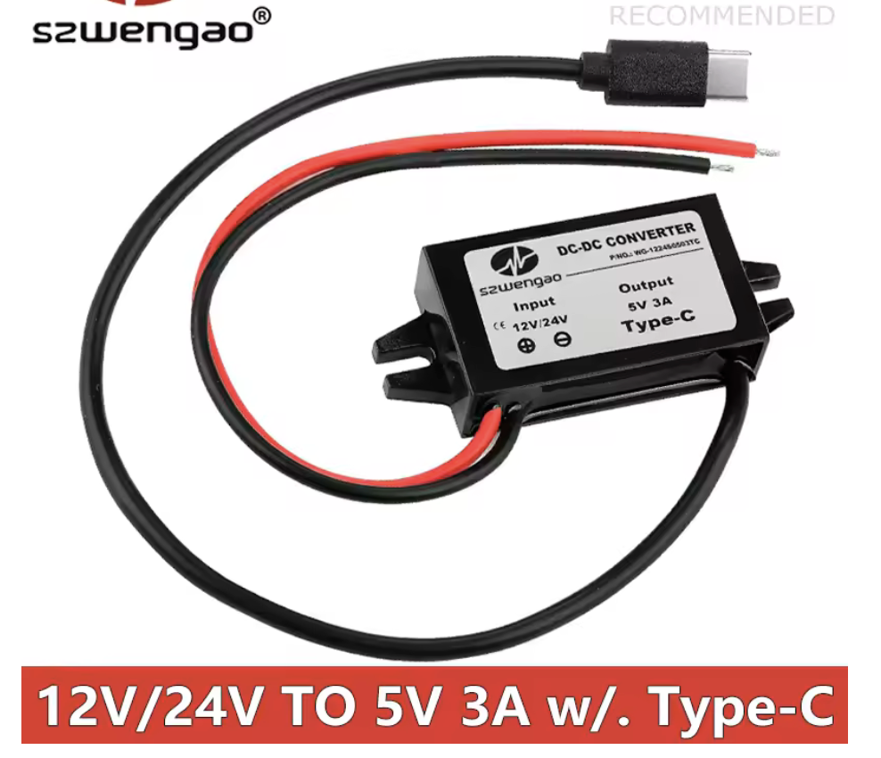

# Tigo RS485 ESP32 Monitor

Monitor in tempo reale per ottimizzatori solari Tigo, basato su ESP32.  
Legge il bus RS-485 (protocollo TAP) e fornisce una dashboard web, WebSocket e persistenza su SPIFFS.




---

## 🛠️ Hardware

| Componente | Note |
|---|---|
| **ESP32 / ESP32-S3** | Flash minimo da 4 MB con partizione SPIFFS |
| **Convertitore TTL→RS485** | MAX485 o simile |
| **Regolatore 5 V** | Se alimentato dal bus RS-485 |

---

## ⚙️ Funzionalità

- 📡 **Lettura bus RS-485** (Tigo TAP/CCA, 38400 baud 8N1)
- 🔍 **Parsing frame**: potenza (0x31), topologia (0x09), NodeTable (0x27)
- 🌐 **WebServer integrato**:
  - `/` – Dashboard live con grafici (ApexCharts) e card per modulo
  - `/debug` – Tabella raw (tensione, corrente, temperatura, RSSI, …)
  - `/panels` – Mappatura manuale longAddress → etichetta (es. A4)
  - `/spiffs` – File manager (upload / download / elimina file SPIFFS)
- 🔌 **WebSocket `/ws`** — aggiornamento real-time; payload per modulo:
  ```json
  {
    "id":       "A4",
    "panel":    "A4",
    "longaddr": "04C05B4000B1A688",
    "barcode":  "04C05B4000B1A688",
    "addr":     "001A",
    "watt":     250,
    "vin":      34.70,
    "vout":     34.40,
    "amp":      6.94,
    "temp":     34.4,
    "rssi":     126
  }
  ```
- 💾 **NodeTable** — salvataggio automatico con debounce 30 s (`/nodetable.json`)
- 🔖 **Panel Map** — associazione persistente longAddress → etichetta (`/panel_map.json`)
- 🕒 **NTP sync** — orario preciso alla sincronizzazione
- 🔁 **OTA** — aggiornamento firmware via rete
- 📊 **Dashboard grafica**:
  - Grafico area — potenza totale nel tempo (ultimi 60 campioni, in-memory)
  - Grafico a barre orizzontali — potenza istantanea per pannello, colorato W→verde
  - Card per ogni modulo con barra di progresso, Vin/Vout, corrente, temperatura, RSSI

---

## 📂 File SPIFFS

| File | Descrizione |
|---|---|
| `index.html` | Dashboard web |
| `nodetable.json` | Mapping addr corto ↔ longAddress (auto-generato) |
| `panel_map.json` | Mapping longAddress ↔ etichetta pannello (gestito da `/panels`) |

---

## 🔖 Mappatura pannelli

Vai su `/panels`: ogni riga mostra il longAddress del modulo (es. `04C05B4000B1A688`).  
Scrivi l'etichetta (es. `A4`) e clicca **Salva**.  
Da quel momento il WebSocket trasmette `"panel": "A4"` e `"id": "A4"` per quel modulo.  
Il longAddress rimane sempre disponibile nei campi `barcode` e `longaddr`.

---

## 🔄 Salvataggio automatico NodeTable

La `loop()` controlla ogni ciclo: se `NodeTable_changed == true` e sono passati ≥ 30 s  
dall'ultimo salvataggio → chiama `saveNodeTable()` e resetta il flag.  
Il salvataggio manuale è disponibile su `/debug` → bottone **Salva NodeTable ora**.

---

## 🧰 Installazione (Arduino IDE)

### 1. Prerequisiti
- **Arduino IDE 2.x**
- Supporto schede ESP32:  
  *File → Preferenze → URL aggiuntivi*:
  ```
  https://espressif.github.io/arduino-esp32/package_esp32_index.json
  ```
  Poi: *Strumenti → Scheda → Gestore schede → "esp32" → Installa*

### 2. Librerie richieste
Installa via *Sketch → Includi libreria → Gestisci librerie*:
- **ArduinoJson** (Benoit Blanchon)
- **ESPAsyncWebServer** + **AsyncTCP**
- **PubSubClient** (MQTT)
- **WebSerial**

### 3. Configurazione scheda
*Strumenti*:
- **Board:** `ESP32 Dev Module` (o variante S3)
- **Partition Scheme:** `No OTA (1MB APP / 3MB SPIFFS)`
- **Upload Speed:** 921600

### 4. Credenziali Wi-Fi
Nel file `TigoServer.ino` (in cima):
```cpp
const char* ssid     = "TuaReteWiFi";
const char* password = "TuaPassword";
```

### 5. Flash firmware
1. Collega ESP32 via USB
2. Clicca **→ Carica**
3. Apri *Monitor Seriale* (115200 baud)

### 6. Carica i file SPIFFS
Installa il plugin **ESP32 Sketch Data Upload**:  
→ [https://github.com/me-no-dev/arduino-esp32fs-plugin](https://github.com/me-no-dev/arduino-esp32fs-plugin)  
Poi: *Strumenti → ESP32 Sketch Data Upload*

### 7. Primo accesso
Trova l'IP in Serial Monitor o nel router DHCP:
```
http://<IP_ESP32>
```
- `/` — Dashboard + grafici
- `/debug` — Dati raw + NodeTable
- `/panels` — Mappatura etichette
- `/spiffs` — File manager

---

## ⚡ Schema di collegamento




| RS-485 | ESP32 | Note |
|---|---|---|
| RO → RX | GPIO 16 | RS-485 → ESP32 |
| DI ← TX | GPIO 17 | ESP32 → RS-485 |
| RE/DE | GND (LOW) | Modalità solo ricezione |
| A / B | Bus TAP ↔ CCA | In parallelo |
| 5 V / GND | Alimentazione condivisa | |

---

## 📎 Crediti

- Reverse engineering protocollo: [willglynn/taptap](https://github.com/willglynn/taptap)
- Progetto originale: [tictactom/tigo_server](https://github.com/tictactom/tigo_server)
- Questa fork aggiunge dashboard grafica, panel mapping, NodeTable persistente, pagine dark-theme.

---

## 🔓 Licenza

MIT — libero adattamento per il proprio impianto.

