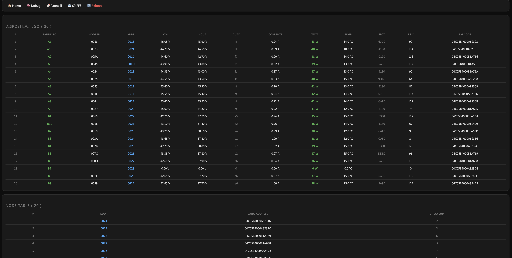

# Tigo RS485 ESP32 Monitor

This project is an enhanced Arduino-based ESP32 sketch to read and log Tigo solar optimizer data (TAP ↔ CCA communication) using RS485.





---

## 🛠️ Hardware Requirements

- **ESP32 / ESP32-S3** (with enough flash for SPIFFS)
- **TTL to RS485 converter** (e.g., MAX485 or similar)
- **5V regulator** if powered directly from the RS485 bus

---

## ⚙️ Features

- 🔌 **Reads data from Tigo TAP/CCA RS485 bus**
- 🔍 **Parses frames including power data (0x31) and barcodes (0x09)**
- 🌐 **Built-in WebServer**:
  - `/` – Live view of all PV modules (with WebSocket)
  - `/debug` – Raw data view (voltage, current, RSSI, etc.)
  - `/spiffs` – File manager (upload/download/delete logs or config)
  - `/logs` – Interactive log viewer (by timestamp)
- 🧠 **Auto barcode detection** via 0x09 frames
- 💾 **Logs to SPIFFS** every 30 s (capped to 7 files)
- 🕒 **NTP sync** for accurate timestamps

---

## 📂 SPIFFS File System

- **nodetable.json** – Keeps module `addr` to `barcode` mapping  
- **log_YYYY-MM-DD.json** – Daily logs with all module values  
- **index.html** – Optional: Custom UI served on `/`

---

## 🔄 Automatic NodeTable Save

Once all modules are matched with barcodes (via 0x09 or `/debug`),  
the mapping is auto-saved to `nodetable.json`.

---

## 🧪 Local Debug

Use WebSerial or `/debug` to inspect live parsed values.

---

## 📡 MQTT

Optionally sends a **startup message** (not real-time data) to a broker.

---

## 🧾 Log Viewer

The `/logs` interface lets you select a log file and timestamp, and view  
all module data from that instant.

---

## 🧰 Installation Guide (Arduino IDE)

### 🔧 1. Prerequisites
- Install **Arduino IDE 2.x**
- Add the **ESP32 board support**:  
  *File → Impostazioni → URL aggiuntive per il Gestore schede*  
  ```
  https://espressif.github.io/arduino-esp32/package_esp32_index.json
  ```
  Then: *Strumenti → Scheda → Gestore schede → cerca “esp32” → Installa*

### 📦 2. Download the project
1. From this repository, click **Code → Download ZIP**
2. Extract it to your Arduino folder, e.g.  
   `Documents/Arduino/tigo_server/`
3. Open `tigo_server.ino` in the Arduino IDE  
   (the folder name must match the `.ino` file name)

### ⚙️ 3. Board configuration
From *Strumenti*:
- **Board:** `ESP32 Dev Module` (or your ESP32 S3 variant)
- **Flash Frequency:** 80 MHz  
- **Upload Speed:** 921600 baud (or 115200 if errors occur)  
- **Partition Scheme:** `No OTA (1MB APP / 3MB SPIFFS)`  
- **Port:** choose your ESP32 serial port  

### 📚 4. Required libraries
Usually included with ESP32 core, but verify the following:
- `WiFi.h`
- `WebServer.h`
- `WebSocketsServer.h`
- `SPIFFS.h`
- `ArduinoJson` → install via *Sketch → Includi Libreria → Gestisci librerie → cerca "ArduinoJson"*

### 🌐 5. Wi-Fi configuration
In `config.h` (or in the main sketch):
```cpp
#define WIFI_SSID "YourWiFi"
#define WIFI_PASS "YourPassword"
```
If left empty, the ESP32 will start its own AP (e.g. `TigoServer_AP`)  
and open a captive portal for Wi-Fi setup.

### 🚀 6. Upload the firmware
1. Connect the ESP32 via USB  
2. Click **→ Carica**  
3. Open *Monitor Seriale* (115200 baud) to view logs:
   ```
   Connecting to WiFi...
   WiFi connected: 192.168.1.xxx
   Starting WebServer on port 80...
   ```

### 💾 7. Upload SPIFFS data (optional)
If you have a `/data` folder (web files):
1. Install **ESP32 Sketch Data Upload** plugin  
   → [https://github.com/me-no-dev/arduino-esp32fs-plugin](https://github.com/me-no-dev/arduino-esp32fs-plugin)
2. Copy it to your Arduino `tools/` directory  
3. Restart Arduino IDE  
4. Run *Strumenti → ESP32 Sketch Data Upload*

### 🌍 8. First access
- Find the IP in the Serial Monitor or your router DHCP table  
- Open in browser:  
  ```
  http://<ESP32_IP>
  ```
You’ll see:
- Live dashboard of PV modules  
- `/debug` for raw frames  
- `/spiffs` file manager  
- `/logs` for historical data  

### 🧩 9. NodeTable and data logs
The ESP32 automatically detects barcodes (frame 0x09) and saves them in  
`nodetable.json`. Logs are rotated daily in SPIFFS.

---

## ⚡ Wiring overview


**Basic connections:**
| RS-485 Module | ESP32 Pin | Note |
|----------------|------------|------|
| RO → RX        | GPIO 16 (default) | RS-485 → ESP32 |
| DI ← TX        | GPIO 17 (default) | ESP32 → RS-485 |
| RE/DE          | LOW (receive-only) | or tie HIGH for TX |
| A/B lines      | Parallel to TAP ↔ CCA bus |
| 5 V / GND      | Shared supply and ground |

---

## 📎 Credits

- Based on the reverse-engineering work by [willglynn/taptap](https://github.com/willglynn/taptap)
- Original project by [tictactom/tigo_server](https://github.com/tictactom/tigo_server)
- This fork expands it into a full local monitoring platform with logs, real-time view, and persistence.

---

## 🔓 License

MIT — feel free to adapt for your system.

Maintained by the community.  
Suggestions and improvements welcome.
